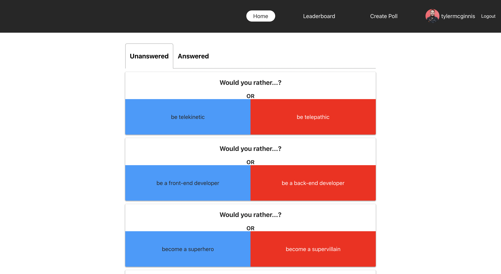
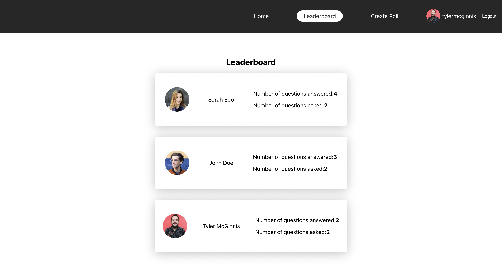
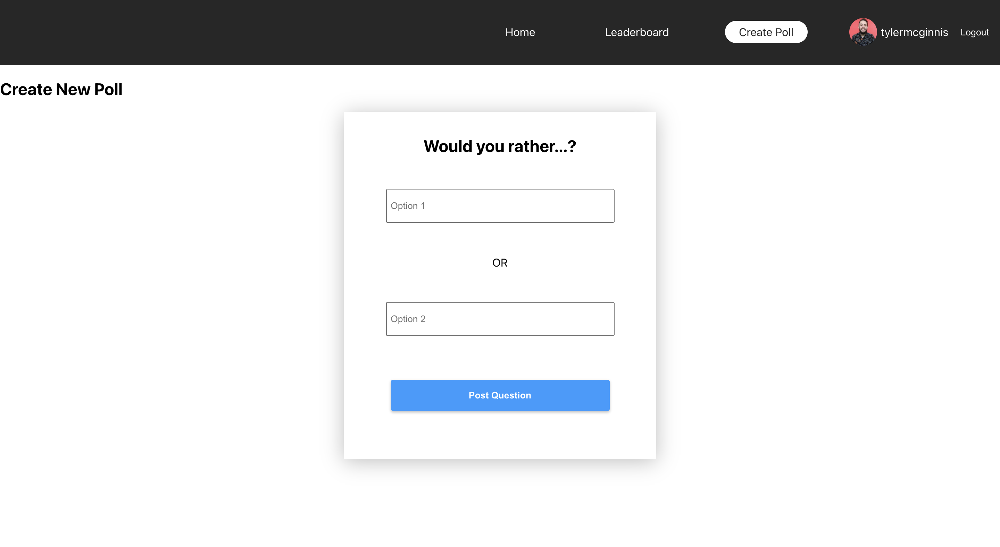
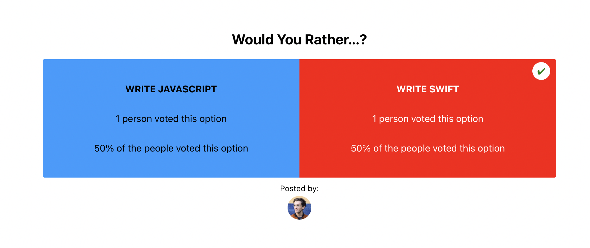
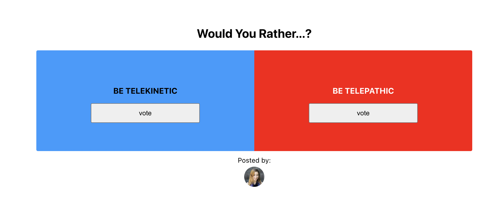

# Would You Rather

Would You Rather is a web application that allows users to be able to vote preferred option for a question. The app allows the user the following:

- Sign in
- View all polls
- Select a particular poll and view its details
- Vote for a particular option in a poll
- Create a poll
- View the leaderboard







## Installation

- install all project dependencies with `npm install`

- start the development server with `npm start`

```
npm install
npm start
```

## Resources Used

I learnt how to use create protected routes from [ Implementing Protected Route and Authentication in React-JS](https://dev.to/olumidesamuel_/implementing-protected-route-and-authentication-in-react-js-3cl4) by [Olumide Samuel](https://dev.to/olumidesamuel_)

I also benefitted from the guidance of a friend [Qasim-Yusuf](https://github.com/Qausim) who tried as much as possible to make sure I stop doubting myself and just write code. Plus also making fun of me as us.

## Comments & Collaboration

For comments, suggestions and collaboration all you can reach me on LinkedIn [Adedeji-Adelanwa](https://www.linkedin.com/in/adelanwaadedeji/)
